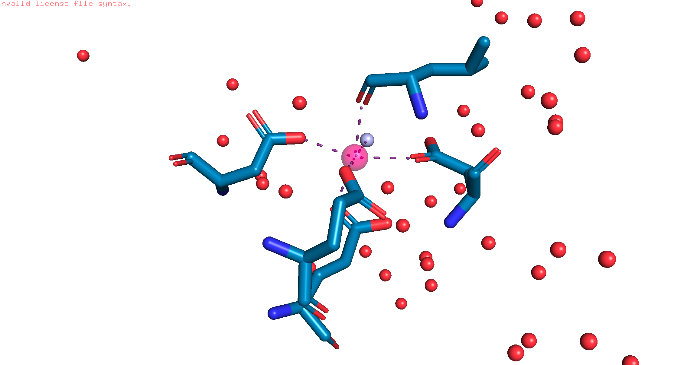
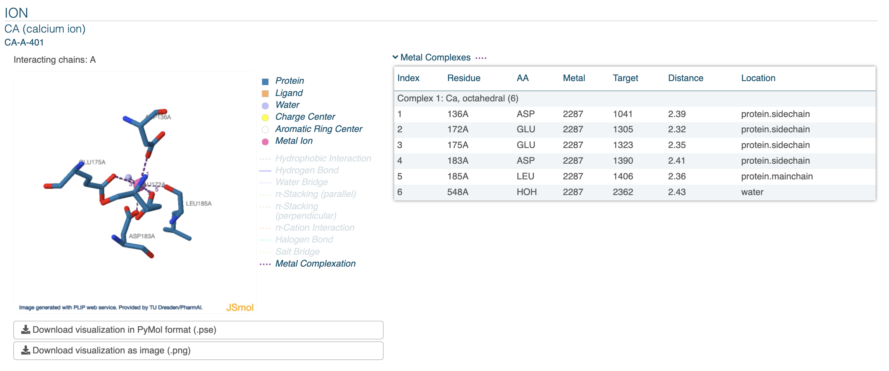
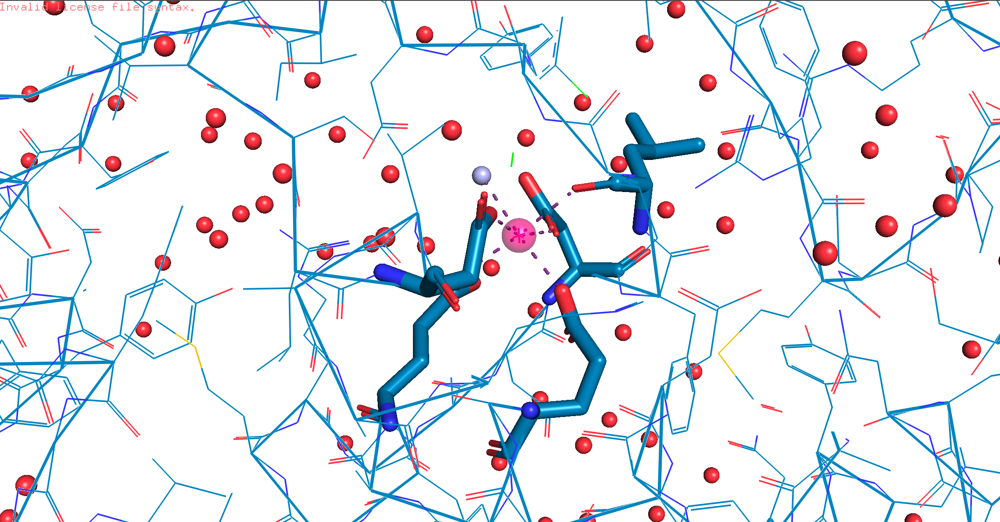

# Prerequisites:

[ ] Need to load 6F8B into [plip](https://plip-tool.biotec.tu-dresden.de/plip-web/plip/index)

[ ] Load the [PYMOL session](plipify/docs/issues/HOH_bridge/6f8b.pse)

# Description
When I was debugging the situation with the [indexing problem](LINKHERE), I also found that there is something potentially wrong with how we handle water bridges. 

To recall from the indexing problem(copying and pasting from the prior issue)


I created debug_to_file.py with Claude, to print out all of the objects per line to 6F8B.txt. The one notable section where the error is thrown is in here(lines 1017-1023):

```
[residues] loaded 298 protein residues
[residues] skipped 1 x CA: seq_index 401..401
[residues] skipped 2 x CXH: seq_index 403..404
[residues] skipped 414 x HOH: seq_index 501..914
[residues] skipped 1 x ZN: seq_index 402..402
[DICT] metal {'RESNR': 548, 'RESTYPE': 'HOH', 'RESCHAIN': 'A', 'RESNR_LIG': 401, 'RESTYPE_LIG': 'CA', 'RESCHAIN_LIG': 'A', 'METAL_IDX': 2287, 'METAL_TYPE': 'Ca', 'TARGET_IDX': 2362, 'TARGET_TYPE': 'O', 'COORDINATION': 6, 'DIST': '2.43', 'LOCATION': 'water', 'RMS': '19.84', 'GEOMETRY': 'octahedral', 'COMPLEXNUM': '1', 'METALCOO': (-4.008, -1.257, -22.031), 'TARGETCOO': (-4.877, -0.644, -24.211)}
[from_pdbfile]      skipping residue lookup for non-protein partner: HOH 548:A LOCATION=water
```

*Opinion in the below paragraph was helped by Gemini, so please help correcting this if any inaccuracies:*
In the calcium ion here, we see that water is a residue. When loading this into PYMOL, we see that the Calcium has 2 valence electrons that are possible candidates to being bonded. This means that there is still 6 potential additional for potential bonding, which allows for other atoms** to bind. However, this begs the question:

Is this a water residue in the crystal structure or is it an artifact? It shares the roughly the same distance as the other residues to bind to the calcium, so it could be a "gap filler". 
Protein backbones are rigid. Often, a protein loop cannot physically fold tightly enough to fit 8 amino acid oxygens around a single metal center without introducing steric strain.
Water is small, mobile, and abundant. It acts as a flexible "gap filler" (or structural bridge) that completes the optimal pentagonal bipyramidal or distorted octahedral geometry without requiring the protein to strain its backbone.


**I was going to say "ions", but I don't think it's ions; as ions wouldn't have a charge, which after the 2 valence electrons are being donated, the net charge on calcium is neutral.  Calcium being a fingerprint(ie. being right in the middle) allows it positionally to be accessible to a lot of different atoms. 





# Next Steps
- Wait for feedback from Hamza/Andrea
    - If it's a protein or ligand residue, I will have to adjust how plipify should handle this