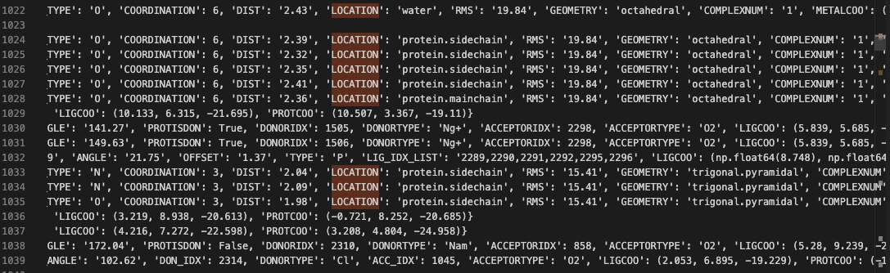
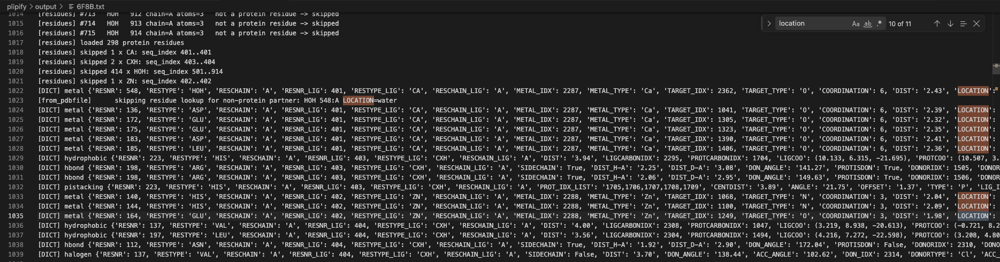

## Description
When trying to run between different pdb files found in plipify/data/sample_pdbs/ [(Commit 64e3520)
](https://github.com/b-horvath/plipify/commit/64e352057b434f9728de089187b269ada95c5806#diff-58a101629186b04efbf8e99e9661d1eff107e3a001c0309dbf00b20c30ddac4f), the majority of the pytests were functional, however, the pytest threw a Value Error for 6F8B.pdb - which has a zinc fingerprint. 

Wrong order - 548 was being thrown before the other 

### Error output: 
*Note: the full error can be found at the bottom of the issue.

```
plipify/tests/test_core.py::TestStructureFromPdbfileFormats::test_pdb_format_loads_across_multiple_sample_files[6F8B.pdb] FAILED 
```

```
>       structure = Structure.from_pdbfile(str(pdb_path))
                    ^^^^^^^^^^^^^^^^^^^^^^^^^^^^^^^^^^^^^

plipify/tests/test_core_og.py:175: 
_ _ _ _ _ _ _ _ _ _ _ _ _ _ _ _ _ _ _ _ _ _ _ _ _ _ _ _ _ _ _ _ _ _ _ _ _ _ _ _ _ _ _ _ _ _ _ _ _ _ _ _ _ _ _ _ _ _ _ _ _ _ _ _ _ _ _ _ _ _ _ _ _ _ _ _ _ _ _ _ _ _
plipify/core_og.py:374: in from_pdbfile
    residue = structure.get_residue_by(seq_index=seq_index, chain=chain)
              ^^^^^^^^^^^^^^^^^^^^^^^^^^^^^^^^^^^^^^^^^^^^^^^^^^^^^^^^^^
```

## Error Source:
The error stems from the following where there is an attribute problem where we see that at seq_index = 548 is called, but it is not there - as the actual protein structure is not being acknowledged.  

```
self = <[AttributeError("'Structure' object has no attribute 'ignored_ligands'") raised in repr()] Structure object at 0x10de70c50>, index = None, seq_index = 548, chain = 'A'
```

```
445 |         if index is not None:
446 |             return self.residues[index]
447 |         if seq_index is not None:
448 |             for residue in self.residues: <-- THIS IS NOT BEIN ACCESSED
449 |                 if residue.seq_index == seq_index:
450 |                     if chain is None:  # TODO: Check there are no other residues with same index!
451 |                         print(
452 |                             "! Warning, you didn't select a chain. "
453 |                             "First match will be returned but there could be more."
454 |                         )
455 |                         break
456 |                     elif chain in ("any", residue.chain):
457 |                         break
458 |             else:  # break not reached!
459 |                 raise ValueError(
460 |                     "No residue with such sequence index: {}, {}!".format(seq_index, chain)
461 |                 )
462 |             return residue
```


I created debug_to_file.py with Claude, to print out all of the objects per line to 6F8B.txt. The one notable section where the error is thrown is in here(lines 1017-1023):

```
1017    [residues] loaded 298 protein residues
1018    [residues] skipped 1 x CA: seq_index 401..401
1019    [residues] skipped 2 x CXH: seq_index 403..404
1020    [residues] skipped 414 x HOH: seq_index 501..914
1021    [residues] skipped 1 x ZN: seq_index 402..402
1022    [DICT] metal {'RESNR': 548, 'RESTYPE': 'HOH', 'RESCHAIN': 'A', 'RESNR_LIG': 401, 'RESTYPE_LIG': 'CA', 'RESCHAIN_LIG': 'A', 'METAL_IDX': 2287, 'METAL_TYPE': 'Ca', 'TARGET_IDX': 2362, 'TARGET_TYPE': 'O', 'COORDINATION': 6, 'DIST': '2.43', 'LOCATION': 'water', 'RMS': '19.84', 'GEOMETRY': 'octahedral', 'COMPLEXNUM': '1', 'METALCOO': (-4.008, -1.257, -22.031), 'TARGETCOO': (-4.877, -0.644, -24.211)}
1023    [from_pdbfile]      skipping residue lookup for non-protein partner: HOH 548:A LOCATION=water
```

Particularly, in line 1022:
- The `RESTYPE` is `HOH`
- The `RESTYPE_LIG` is `CA` 
- The `METAL_TYPE` is `'Ca'`
- and the `LOCATION` is `water`

So this inconsistency is definitely some kind of bug. 

Here, from_pdbfile is called, but there is some reference to a water, which is evident in the [BindingSiteReport in core.py](TODO-linkhere)

```
391 report = BindingSiteReport(site)
```

Which references to the self.metal_features in [.venv/lib/python3.11/site-packages/plip/exchange/report.py](TODO-linkhere)

```
self.metal_features = (
            'RESNR', 'RESTYPE', 'RESCHAIN', 'RESNR_LIG', 'RESTYPE_LIG', 'RESCHAIN_LIG', 'METAL_IDX', 'METAL_TYPE',
            'TARGET_IDX', 'TARGET_TYPE',
            'COORDINATION', 'DIST', 'LOCATION', 'RMS', 'GEOMETRY', 'COMPLEXNUM', 'METALCOO',
            'TARGETCOO')
        self.metal_info = []
        # Coordinate format here is non-standard since the interaction partner can be either ligand or protein
        for m in self.complex.metal_complexes:
            self.metal_info.append(
                (m.resnr, m.restype, m.reschain, m.resnr_l, m.restype_l, m.reschain_l, m.metal_orig_idx, m.metal_type,
                 m.target_orig_idx, m.target_type, m.coordination_num, '%.2f' % m.distance,
                 m.location, '%.2f' % m.rms, m.geometry, str(m.complexnum), m.metal.coords,
                 m.target.atom.coords))

```

So we are detecting that there is a metal ion present, however we are not dealing with it properly. 

## Current Problem:
There are two problems to this problem:
1. We don't know how this would act if the HOH would be classified under the LigandResidue (as it is not built yet)
2. The actual problem lies in how core.py handles HOH being part of the residue, under a metal complex. 

The first problem is that the current model treats the input pdb exclusively as a ProteinResidue that only takes in the [canonical amino acids](https://github.com/volkamerlab/plipify/blob/master/plipify/core.py#L190-193).

1. We know that core.py only handles any inputs solely as ProteinResidues as [LigandResidue](https://github.com/volkamerlab/plipify/blob/master/plipify/core.py#L230-237) is not built out yet:
```
class LigandResidue(BaseResidue):
    """
    A small molecule in the vicinity of a binding site
    """

    # TODO: Fill list in!
    _ALLOWED_RESIDUE_NAMES = []
```

2. The code treats the water at location 548 as a protein.sidechain - and not as a water. Below we see that the location in the repr is inconsistent with how PLIP identifies the water.



There are actually 9 other instances of this metal being correctly detected as being `protein.sidechain`s. But the water is not being registered correctly.


# Attempted Solutions:

- Added a one liner to see if the parser goes over a metal ion, we see that if 'LOCATION' is in it's repr object*. 
    ```
     if not interaction_dict.get("LOCATION", "protein").startswith("protein"):
                            interactions.append(InteractionType(interaction=interaction_dict))
                            continue
    ```
    - However, we do not know if this should traditionally be viewed as a protein residue or a ligand residue; and if it is a ligand residue, we should now build out the LigandResidue class in core.py.
    - It seems that PLIP identifies it as being a water, but it just has a different location tag for it. But is this a potential site for a water bridge? TODO:@hamza or @andrea
- It seems 

*How do you say this sentence properly(if I watned to use repr in the sentence)?


# Unanswered Questions:

- We see that water was the one that was being first reported, but I don't understand why this was the first one to appear before the others. 
- We see that water had this location tag, but we also saw that there is other metals had location tags underneath it that will probably raise some ValueErrors in the future. I will address this in the future. 
    - The halogens and hydrophobics still need to be investigated because they 
        -  We need isolated pdb's that will be ground truths for all of these particular bonds. 


# Next Steps:
- Review the process that if we can use this one liner, if it will fix the problem.

```
 if not interaction_dict.get("LOCATION", "protein").startswith("protein"):
                            interactions.append(InteractionType(interaction=interaction_dict))
                            continue
```


## Full Error:

### Input:
```
python -m pytest -W "ignore" -v plipify/tests/test_core.py
```

### Output:
```
============================================================================ FAILURES =============================================================================
__________________________________ TestStructureFromPdbfileFormats.test_pdb_format_loads_across_multiple_sample_files[6F8B.pdb] ___________________________________
self = <plipify.tests.test_core_og.TestStructureFromPdbfileFormats object at 0x74ce8185c410>
pdb_path = PosixPath('/home/ben/Desktop/plipify/plipify/data/sample_pdbs/6F8B.pdb')

    @pytest.mark.integration
    @pytest.mark.parametrize(
        "pdb_path", sorted(SAMPLE_PDBS_DIR.glob("*.pdb")), ids=lambda p: p.name
    )
    def test_pdb_format_loads_across_multiple_sample_files(self, pdb_path):
        """
        Generic over whatever .pdb files happen to live in the target directory.
        """
        pytest.importorskip("plip")
        if not pdb_path.exists():
            pytest.skip(f"sample PDB not available: {pdb_path}")
    
>       structure = Structure.from_pdbfile(str(pdb_path))
                    ^^^^^^^^^^^^^^^^^^^^^^^^^^^^^^^^^^^^^

plipify/tests/test_core_og.py:175: 
_ _ _ _ _ _ _ _ _ _ _ _ _ _ _ _ _ _ _ _ _ _ _ _ _ _ _ _ _ _ _ _ _ _ _ _ _ _ _ _ _ _ _ _ _ _ _ _ _ _ _ _ _ _ _ _ _ _ _ _ _ _ _ _ _ _ _ _ _ _ _ _ _ _ _ _ _ _ _ _ _ _
plipify/core_og.py:374: in from_pdbfile
    residue = structure.get_residue_by(seq_index=seq_index, chain=chain)
              ^^^^^^^^^^^^^^^^^^^^^^^^^^^^^^^^^^^^^^^^^^^^^^^^^^^^^^^^^^
_ _ _ _ _ _ _ _ _ _ _ _ _ _ _ _ _ _ _ _ _ _ _ _ _ _ _ _ _ _ _ _ _ _ _ _ _ _ _ _ _ _ _ _ _ _ _ _ _ _ _ _ _ _ _ _ _ _ _ _ _ _ _ _ _ _ _ _ _ _ _ _ _ _ _ _ _ _ _ _ _ _

self = <[AttributeError("'Structure' object has no attribute 'ignored_ligands'") raised in repr()] Structure object at 0x74ce7db8eed0>, index = None
seq_index = 548, chain = 'A'

    def get_residue_by(self, index=None, seq_index=None, chain=None):
        """
        Access residues by either position in the Python list (index)
        or their sequence identifier in the PDB records (seq_index)
    
        Parameters
        ----------
        index, seq_index : int
        chain : str or None
            If chain is None or "any", behaviour is not specified
            shall there exist more than one residue with that
            seq_index. If None, a warning will be emitted; this
            warning is omitted if chain == "any".
        """
    
        if index is None and seq_index is None:
            return None
        if index is not None and seq_index is not None:
            raise ValueError("Can only specify index OR seq_index, not both")
        if index is not None and chain not in (None, "any"):
            raise ValueError("`index` does not support `chain` spec")
    
        if index is not None:
            return self.residues[index]
        if seq_index is not None:
            for residue in self.residues:
                if residue.seq_index == seq_index:
                    if chain is None:  # TODO: Check there are no other residues with same index!
                        print(
                            "! Warning, you didn't select a chain. "
                            "First match will be returned but there could be more."
                        )
                        break
                    elif chain in ("any", residue.chain):
                        break
            else:  # break not reached!
>               raise ValueError(
                    "No residue with such sequence index: {}, {}!".format(seq_index, chain)
                )
E               ValueError: No residue with such sequence index: 548, A!

plipify/core_og.py:459: ValueError
===================================================================== short test summary info =====================================================================
FAILED plipify/tests/test_core_og.py::TestStructureFromPdbfileFormats::test_pdb_format_loads_across_multiple_sample_files[6F8B.pdb] - ValueError: No residue with such sequence index: 548, A!
```
